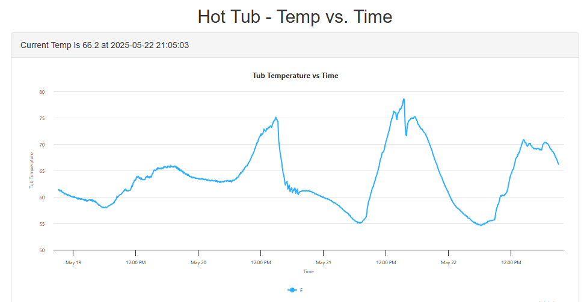

# Hot Tub Data Logger & Dashboard

Welcome to the **Hot Tub Data Logger & Dashboard** project!  
This project provides a complete solution for logging, storing, and visualizing hot tub and ambient environmental data using Python, PHP, and MySQL.

---

## 📦 Project Structure

```
.
├── bme280_test.py         # Ambient sensor logger (Python)
├── ds18b20_test.py        # Hot tub temperature logger (Python)
├── index.php              # Web dashboard (PHP/Highcharts)
├── .d_hottub_db.json      # Database credentials (DO NOT SHARE)
└── README.md              # Project documentation
```

---

## 🚀 Features

- **Automated Data Logging:**  
  - Logs hot tub temperature (DS18B20 sensor)
  - Logs ambient temperature, humidity, pressure, altitude (BME280 sensor)
- **Secure Database Integration:**  
  - Credentials loaded from `.d_hottub_db.json` in your home directory
- **Interactive Web Dashboard:**  
  - Visualizes temperature, humidity, and pressure trends with Highcharts
  - Responsive and mobile-friendly interface

---

## 🛠️ Setup Instructions

### 1. Clone the Repository

```sh
git clone https://github.com/yourusername/d_hottub.git
cd d_hottub
```

### 2. Configure Database Credentials

Create a `.d_hottub_db.json` file in your home directory:

```json
{
    "host": "127.0.0.1",
    "user": "your_db_user",
    "password": "your_db_password",
    "database": "your_db_name"
}
```

**Never commit this file to version control.**

### 3. Install Python Dependencies

```sh
pip install mysql-connector-python adafruit-circuitpython-bme280
```

### 4. Set Up the Database

- Create the required tables (`tub`, `ambient`) in your MySQL/MariaDB database.
- Example schema (customize as needed):

```sql
CREATE TABLE tub (
    entry_number INT AUTO_INCREMENT PRIMARY KEY,
    entry_time TIMESTAMP DEFAULT CURRENT_TIMESTAMP,
    temperature FLOAT
);

CREATE TABLE ambient (
    entry_number INT AUTO_INCREMENT PRIMARY KEY,
    entry_time TIMESTAMP DEFAULT CURRENT_TIMESTAMP,
    temperature FLOAT,
    pressure FLOAT,
    humidity FLOAT,
    altitude FLOAT
);
```

### 5. Run the Data Loggers

```sh
python ds18b20_test.py
python3 bme280_test.py
```

### 6. Deploy the Web Dashboard

- Place `index.php` on your PHP-enabled web server.
- Ensure the web server user can read your `.d_hottub_db.json` file.
- Highcharts and other JS libraries are loaded via CDN, so no local `charts/` folder is needed.

### 7. Automate Data Logging with Cron

To automatically log data every 5 minutes, add the following lines to your superuser (root) crontab:

```sh
sudo crontab -e
```

Then add:

```
*/5 * * * * /usr/bin/python3 /home/pi/bme280_test.py
*/5 * * * * /usr/bin/python /home/pi/ds18b20_test.py
```

**Tip:**  
- Adjust the paths to match the actual locations of your Python files.
- Make sure both scripts are executable:  
  ```sh
  chmod +x /home/pi/bme280_test.py /home/pi/ds18b20_test.py
  ```
- Use the full path to your Python interpreter (e.g., `/usr/bin/python3` or `/usr/bin/python`).

This will ensure your data loggers run automatically every 5 minutes.

Also!  If this will be installed on a wireless device - consider installing the [wifi keepalive](https://github.com/betterthanalemur/wifi_keepalive/blob/master/wifi_keepalive.sh) script!

---

## 📊 Screenshots



---

## 🤝 Contributing

Pull requests and suggestions are welcome!  
Please open an issue to discuss your ideas or report bugs.

---

## 📄 License

This project is licensed under the MIT License.  
See [LICENSE](LICENSE) for details.

---

## 👤 Author

- **betterthanalemur**  
  [betterthanalemur@yahoo.com](mailto:betterthanalemur@yahoo.com)

---

*Made with ❤️ for hot tub enthusiasts everywhere!*